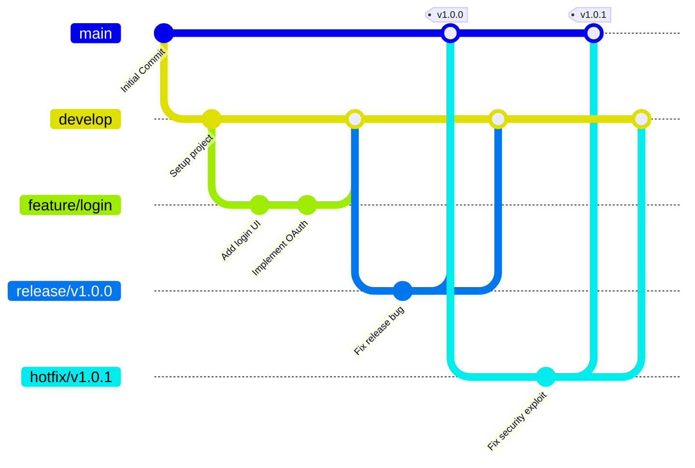

# Git Flow 브랜치 전략 (Git Flow Branching Strategy)

- **Date**: 2026-06-06
- **Tags**: #Git #GitFlow #BranchingStrategy #DevOps #Unknown

---

## 1. 개요 (Overview)

**Git Flow**는 2010년 빈센트 드리센(Vincent Driessen)의 블로그 글을 통해 널리 알려진 **Git 브랜치 관리 및 워크플로우 전략**입니다. 
소스코드 관리, 배포 주기 조율, 버그 수정 등 대규모 협업 과정에서 브랜치를 효율적으로 나누어 개발 프로세스를 고도로 구조화하고 병목 현상을 최소화하는 것을 목적으로 합니다.

---

## 2. 5가지 핵심 브랜치 구조 (5 Core Branches)

Git Flow는 역할을 기준으로 크게 **항시 유지되는 메인 브랜치(2개)**와 **필요할 때 만들고 삭제하는 보조 브랜치(3개)**로 나뉩니다.



### 2-1. 메인 브랜치 (Main Branches) - 무한 수명
- **`main` (또는 `master`)**: 제품으로 배포 가능한 완성된 상태의 코드가 병합되는 브랜치입니다. 모든 커밋은 릴리즈 태그(예: `v1.0.0`)와 함께 관리됩니다.
- **`develop`**: 다음 배포를 위해 새롭게 개발 중인 기능들이 모이는 핵심 통합 브랜치입니다. 일상적인 개발 작업의 중심점입니다.

### 2-2. 보조 브랜치 (Supporting Branches) - 유한 수명
- **`feature/` (기능 개발)**: 새로운 기능을 개발할 때 사용합니다. `develop`에서 갈라져 나와 작업 후 다시 `develop`으로 병합됩니다.
- **`release/` (출시 준비)**: 새로운 정식 버전을 출시하기 전 버그 수정 및 최종 점검(QA)을 수행합니다. `develop`에서 생성되어, 작업 완료 후 `main`과 `develop` 양쪽에 병합됩니다.
- **`hotfix/` (긴급 수정)**: 실서비스(`main`)에 치명적인 버그가 발견되었을 때 즉각 대응하기 위해 사용합니다. `main`에서 직접 파생되어 해결 후 `main`과 `develop` 모두에 수정을 제안/병합합니다.

---

## 3. 브랜치별 워크플로우 및 핵심 명령어

### 3-1. Feature 브랜치 (기능 추가)
- **출발점**: `develop`
- **병합대상**: `develop`

```bash
# 1. develop 브랜치 최신화 후 feature 브랜치 생성
git checkout develop
git pull origin develop
git checkout -b feature/login

# 2. 기능 개발 진행 및 커밋
git commit -am "Implement OAuth2.0 login logic"

# 3. 작업 완료 후 develop에 병합 (Pull Request 권장)
git checkout develop
git pull origin develop
git merge --no-ff feature/login

# 4. 로컬 및 원격 브랜치 삭제
git branch -d feature/login
```

> **`--no-ff` (No Fast-Forward) 플래그 권장**: 히스토리를 합치지 않고 가지(Branch)를 남겨두어, 어떤 커밋들이 특정 기능 브랜치에서 발생했는지 일관되게 추적할 수 있도록 합니다.

### 3-2. Release 브랜치 (배포 준비)
- **출발점**: `develop` (배포할 기능들이 다 준비되었을 때)
- **병합대상**: `main` & `develop`

```bash
# 1. release 브랜치 생성
git checkout -b release/v1.0.0 develop

# 2. 최종 마이너 버그 수정 및 버프 버전 업그레이드 작업 후 커밋
git commit -am "Fix minor UI padding issue in dashboard"

# 3. main 브랜치에 병합 및 버전 태깅
git checkout main
git merge --no-ff release/v1.0.0
git tag -a v1.0.0 -m "Release version 1.0.0"

# 4. 수정사항 반영을 위해 develop에도 병합
git checkout develop
git merge --no-ff release/v1.0.0

# 5. release 브랜치 삭제
git branch -d release/v1.0.0
```

### 3-3. Hotfix 브랜치 (긴급 버그 수정)
- **출발점**: `main`
- **병합대상**: `main` & `develop`

```bash
# 1. main 브랜치에서 hotfix 브랜치 즉시 파생
git checkout main
git checkout -b hotfix/v1.0.1

# 2. 문제점 긴급 패치 후 커밋
git commit -am "Patch severe memory leak in token validation"

# 3. main에 병합 후 태깅
git checkout main
git merge --no-ff hotfix/v1.0.1
git tag -a v1.0.1 -m "Hotfix security patch"

# 4. develop에도 패치 내용 전달을 위해 병합
git checkout develop
git merge --no-ff hotfix/v1.0.1

# 5. hotfix 브랜치 삭제
git branch -d hotfix/v1.0.1
```

---

## 4. 타 전략과의 비교 (Git Flow vs GitHub Flow)

| 비교 항목 | Git Flow | GitHub Flow |
|:---|:---|:---|
| **프로세스 복잡성** | 복잡함 (5가지 브랜치 분기 관리) | 매우 단순함 (`main`과 `feature` 중심) |
| **적합한 프로젝트** | - 정기적인 릴리즈 주기가 있는 패키지 앱<br>- 버전 관리가 엄격히 요구되는 모바일 앱/임베디드 소프트웨어 | - 수시로 배포(CD)되는 웹 서비스<br>- 소규모 팀 및 빠른 이터레이션이 필요한 프로젝트 |
| **메인 브랜치 상태** | `develop`과 `main` 투 트랙 구조 | `main`은 언제든 배포 가능한 상태를 유지 |
| **장점** | 역할 분담이 철저하며 롤백이 명확함 | 가볍고 단순하여 속도가 매우 빠름 |

---

## 5. 실무 권장 수칙 (Best Practices)

1. **Pull Request 기반 병합**: `develop`이나 `main` 브랜치에 직접 푸시(Push)하지 않고, 항상 Pull Request(PR) 혹은 Merge Request(MR)를 통과시켜 코드 리뷰와 CI/CD 자동 빌드를 거쳐야 합니다.
2. **이름 규칙 통일**:
   - `feature/issue-123` 또는 `feature/auth-login`
   - `release/v1.2.0`
   - `hotfix/v1.2.1`
3. **잦은 동기화**: `feature` 브랜치에서 너무 오랫동안 혼자 작업하지 말고, `develop` 브랜치의 최신 변경 사항을 지속적으로 받아와(Rebase 또는 Merge) 충돌(Conflict)을 미연에 방지합니다.

---
**출처**: Vincent Driessen — "A successful Git branching model" (2010) · Atlassian Git Tutorials (Git Flow Workflow)
