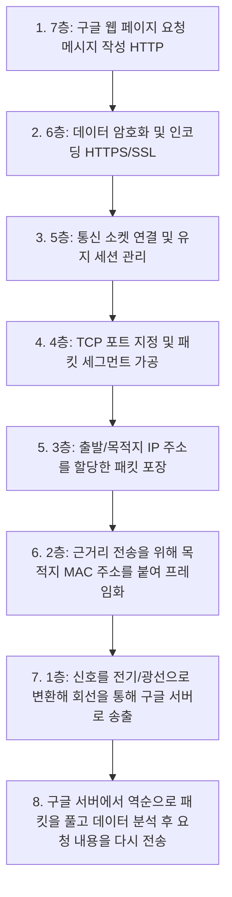

# OSI 7계층 (OSI 7 Layers)

- **Date**: 2026-06-06
- **Tags**: #CS #Network #OSI7Layers #Protocol

---

## 1. 개요 (Overview)

**프로토콜(Protocol)**은 컴퓨터나 네트워크 장비가 서로 정보를 오차 없이 주고받기 위해 정의한 **통신 규약**입니다. ISO(국제표준화기구)가 제정한 **OSI 7계층(Open Systems Interconnection 7 Reference Model)**은 통신이 일어나는 과정을 7단계로 나누어 표준화한 것으로, 이 규약이 정립되어 있지 않으면 서로 다른 환경에서 동일한 서비스를 정상적으로 제공받을 수 없습니다.

---

## 2. OSI 7계층 한눈에 보기 (Summary Table)

| 계층 (Layer) | 전송 단위 (PDU) | 대표 장치 (Device) | 주요 주소 / 프로토콜 (Protocol) | 핵심 역할 (Core Role) |
|:---|:---|:---|:---|:---|
| **7층. 응용 (Application)** | Data | PC, 스마트폰 등 | HTTP, FTP, SMTP, DNS, KakaoTalk | 사용자가 네트워크에 접속할 수 있는 인터페이스 제공 |
| **6층. 표현 (Presentation)** | Data | 없음 (OS 내부) | ASCII, UTF-8, SSL/TLS, JPEG | 데이터의 형식 변환, 암복호화, 압축 및 표현 양식 통일 |
| **5층. 세션 (Session)** | Data | 없음 (OS 내부) | SSH, RPC, 소켓(Socket) 통신 | 송수신측 간의 세션 구축, 유지, 종료 및 동기화 |
| **4층. 전송 (Transport)** | Segment (TCP) Datagram (UDP) | L4 스위치, Gateway | TCP, UDP / Port 번호 | 종단 간(End-to-End) 신뢰성 있고 효율적인 데이터 전송 |
| **3층. 네트워크 (Network)** | Packet | 라우터, 공유기, L3 스위치 | IP, ICMP, ARP / IP 주소 | 최적의 경로 설정(Routing) 및 데이터 목적지 전달 |
| **2층. 데이터 링크 (Data Link)** | Frame | L2 스위치, 브릿지 | Ethernet, MAC / MAC 주소 | 인접 노드 간의 신뢰성 있는 프레임 전송 및 물리적 오류 제어 |
| **1층. 물리 (Physical)** | Bit | 케이블, 허브, 리피터 | 랜선, 광케이블 등 | 0과 1로 구성된 신호(전기/광)의 전달 및 증폭 |

---

## 3. 계층별 상세 설명

### 1) 물리 계층 (Physical Layer)
- **전송 단위**: Bit (0과 1)
- **대표 장치**: 랜선, 케이블, 허브(Hub), 리피터(Repeater)
- **주요 프로토콜**: Ethernet (물리적 규격)
- **핵심 역할**: 데이터를 전기 신호나 광 신호로 변환하여 물리적인 매체로 송수신하고, 약해진 신호를 증폭하여 다음 장비로 안전하게 도달하도록 돕습니다.

### 2) 데이터 링크 계층 (Data Link Layer)
- **전송 단위**: Frame (프레임)
- **대표 장치**: L2 스위치, 네트워크 카드(NIC)
- **주요 주소**: MAC 주소
- **핵심 역할**: 1층에서 전송된 물리적 비트 신호를 '프레임' 단위로 묶어 인접 장비 간의 논리적 연결을 수립합니다. 물리적 계층에서 발생한 오류를 검출하고 제어합니다.

### 3) 네트워크 계층 (Network Layer)
- **전송 단위**: Packet (패킷)
- **대표 장치**: 라우터, 공유기, L3 스위치
- **주요 주소**: IP 주소
- **핵심 역할**: IP 주소를 기반으로 최적의 경로(Routing)를 지정하여 상대방 컴퓨터로 데이터를 정확히 전달합니다. 전 세계의 수많은 독립적인 네트워크들을 서로 이어주는 핵심 통로 역할을 합니다.

### 4) 전송 계층 (Transport Layer)
- **전송 단위**: Segment (TCP), Datagram (UDP)
- **대표 장치**: L4 스위치, Gateway
- **주요 주소 / 프로토콜**: TCP, UDP / Port (포트) 번호
- **핵심 역할**: 양 끝단의 송수신자들이 신뢰성 있는 데이터를 실시간으로 주고받을 수 있도록 흐름 제어, 혼잡 제어, 오류 복구를 담당합니다. 3웨이 핸드셰이크(3-Way Handshake) 등이 이곳에 해당합니다.

### 5) 세션 계층 (Session Layer)
- **전송 단위**: Data
- **대표 장치**: 소프트웨어 영역 (장치 없음)
- **주요 주소 / 프로토콜**: SSH, RPC, 소켓(Socket) 통신 방식
- **핵심 역할**: 통신 장치들 간의 연결(세션)을 만들고, 상태 정보를 동기화하며, 장시간 연결 상태를 안전하게 제어합니다. 단방향, 반이중, 전이중 방식의 정보 전달 관리가 이뤄집니다.

### 6) 표현 계층 (Presentation Layer)
- **전송 단위**: Data
- **대표 장치**: 소프트웨어 영역 (장치 없음)
- **주요 주소 / 프로토콜**: ASCII, UTF-8, SSL/TLS, 암호화/복호화 알고리즘
- **핵심 역할**: 송수신자가 데이터를 올바르게 이해할 수 있도록 공통의 데이터 형식으로 변환(인코딩/디코딩)하고, 보안을 위한 암복호화 작업 및 파일 압축을 전담합니다.

### 7) 응용 계층 (Application Layer)
- **전송 단위**: Data
- **대표 장치**: 크롬 브라우저, 카카오톡 등 사용자 애플리케이션
- **주요 주소 / 프로토콜**: HTTP, HTTPS, FTP, SMTP, DNS
- **핵심 역할**: 사용자가 체감하고 직접 이용하는 영역입니다. 사용자의 요청(예: 구글 웹 페이지 방문, 채팅 메시지 전송 등)을 받아 아래 계층으로 통신 프로세스를 시작하는 진입점입니다.

---

## 4. 실제 통신 예시 (구글 검색 흐름)

웹 브라우저에 "구글"을 검색해 정보를 받아오기까지의 OSI 7계층 관점의 논리적 흐름입니다.

---

## 5. 계층별 발생 가능 오류 & 트러블슈팅 가이드

네트워크에서 문제가 생겼을 때, 계층별로 나누어 진단하면 신속하고 정확하게 문제 원인을 파악할 수 있습니다.

| 계층 | 발생 가능한 주요 장애 상황 | 문제 해결 접근법 (Troubleshooting) |
|:---|:---|:---|
| **1층 (물리)** | - 랜선 미연결, 케이블 단선 - 허브/스위치 전원 차단 | - 물리적 연결 케이블 점검 (포트 결합 여부 확인) - 장비의 전원 확인 및 신호 증폭기 점검 |
| **2층 (데이터 링크)** | - 동일 로컬 네트워크 내 통신 안 됨 (스위칭 장애) - LAN 카드 설정 오류 | - L2 스위치 상태 확인 - MAC 주소 테이블 점검 및 드라이버 재설치 |
| **3층 (네트워크)** | - 해외 사이트나 외부 네트워크 통신 차단 (라우팅 에러) - 잘못된 IP/서브넷마스크 대역 설정 | - `ping [목적지 IP]` 테스트로 대상 접근성 파악 - `tracert` 명령어로 어느 구간에서 패킷이 소실되는지 점검 |
| **4층 (전송)** | - 포트 포워딩 차단으로 서비스 접속 불가능 - 패킷 유실 및 대기시간 초과 (Timeout) - 포트 충돌 | - `netstat -ano` 등으로 포트 활성화 여부 및 대기 포트 점검 - 방화벽 설정에서 타겟 포트 허용 처리 여부 확인 |
| **5층 (세션)** | - 사용자 인증 풀림, 비정상적 세션 만료 - 서버 과부하로 인한 세션 터짐 | - 소켓 연결 및 하트비트(Heartbeat) 생존 주기 주기 확인 - 타임아웃 세팅 값 조정 및 세션 데이터베이스 검토 |
| **6층 (표현)** | - 화면에 한글 폰트나 텍스트가 깨져서 보이는 현상 - 암복호화 키 불일치로 데이터 에러 | - 인코딩 설정 교정 (ASCII ↔ UTF-8 등) - SSL/TLS 인증서 만료 확인 및 암호 알고리즘 일치 여부 확인 |
| **7층 (응용)** | - API 응답 실패 (404, 500 에러 등) - 클라이언트 UI/UX 오동작 | - 브라우저 개발자 도구(F12) 콘솔/네트워크 탭으로 API 통신 분석 - 프론트엔드 코드 및 백엔드 로직 디버깅 |

---
**출처**: ISO 7498 Open Systems Interconnection · 일반적인 컴퓨터 네트워크 기술 가이드 및 교육 자료 정리
