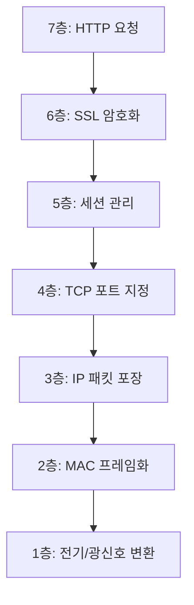

# [Network] OSI 7계층

- **Date**: 2026-06-06
- **Tags**: #Network #OSI7Layers #Protocol

---

# 1. 개요

---

**프로토콜(Protocol)**은 컴퓨터나 네트워크 장비가 서로 정보를 오차 없이 주고받기 위해 정의한 **통신 규약**입니다. ISO(국제표준화기구)가 제정한 **OSI 7계층(Open Systems Interconnection 7 Reference Model)**은 통신이 일어나는 과정을 7단계로 나누어 표준화한 것으로, 이 규약이 정립되어 있지 않으면 서로 다른 환경에서 동일한 서비스를 정상적으로 제공받을 수 없습니다.

# 2. 계층별 요약

---

| 계층 (Layer) | 전송 단위 (PDU) | 대표 장치 (Device) | 주요 프로토콜 (Protocol) |
|:---|:---|:---|:---|
| **7층. 응용** | Data | PC, 스마트폰 | HTTP, FTP, SMTP, DNS |
| **6층. 표현** | Data | 없음 | ASCII, UTF-8, SSL/TLS |
| **5층. 세션** | Data | 없음 | SSH, RPC, Socket |
| **4층. 전송** | Segment/Datagram | L4 스위치, Gateway | TCP, UDP / Port |
| **3층. 네트워크** | Packet | 라우터, 공유기 | IP, ICMP, ARP |
| **2층. 데이터 링크** | Frame | L2 스위치 | Ethernet, MAC |
| **1층. 물리** | Bit | 케이블, 허브 | 랜선, 광케이블 |

# 3. 계층별 상세 설명

---

### 1) 하위 계층 (1~3층)
- **1층(물리)**: 0과 1을 전기/광 신호로 변환하여 전송합니다.
- **2층(데이터 링크)**: 프레임 단위로 묶어 인접 장비 간 논리적 연결을 수행합니다.
- **3층(네트워크)**: IP 주소를 기반으로 최적의 경로(Routing)를 설정하여 전달합니다.

### 2) 상위 계층 (4~7층)
- **4층(전송)**: 종단 간(End-to-End) 신뢰성 있는 데이터를 실시간으로 주고받습니다.
- **5층(세션)**: 통신 장치 간의 연결을 만들고 상태를 동기화합니다.
- **6층(표현)**: 인코딩/디코딩, 암복호화, 데이터 압축을 담당합니다.
- **7층(응용)**: 사용자 요청을 받아 통신 프로세스를 시작하는 진입점입니다.

# 4. 실제 통신 예시

---

웹 브라우저에 정보를 받아오기까지의 논리적 흐름입니다.

# 5. 트러블슈팅 가이드

---

| 계층 | 주요 장애 상황 | 해결 방법 |
|:---|:---|:---|
| **1층** | 물리적 연결 단선 | 케이블 및 전원 확인 |
| **2층** | 로컬 통신 장애 | 스위치 상태 확인 |
| **3층** | 라우팅/IP 설정 오류 | ping/tracert 확인 |
| **4층** | 포트 포워딩/방화벽 | netstat 및 포트 체크 |
| **5층** | 세션 만료 | 타임아웃 설정 점검 |
| **6층** | 인코딩/인증 오류 | 암호화 설정 확인 |
| **7층** | 응용단 에러 | API 디버깅 |

---
**출처**: ISO 7498 Open Systems Interconnection · 일반적인 컴퓨터 네트워크 기술 가이드
