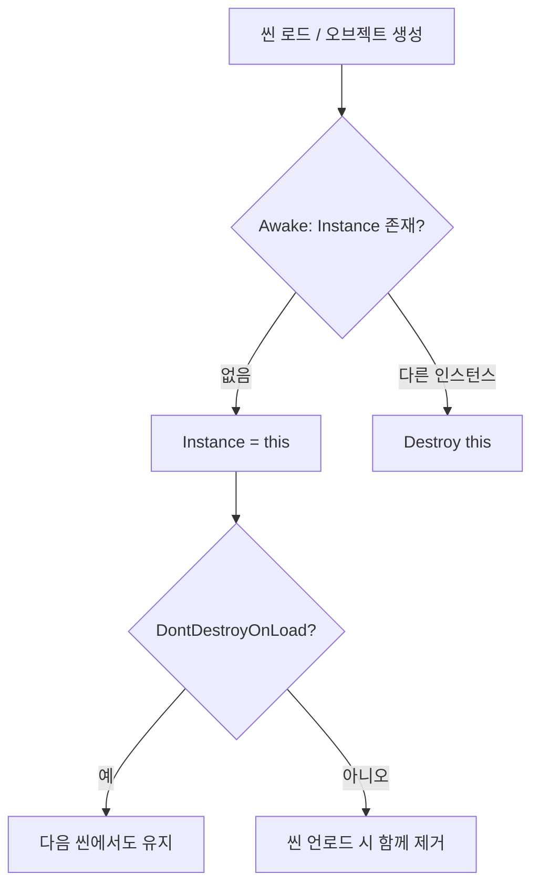

# [Design Pattern] 싱글톤 패턴

- **Date**: 2026-06-06
- **Tags**: #Unity #DesignPattern #Singleton

---

# 1. 개요

---

**싱글톤(Singleton)**은 클래스의 인스턴스가 **전역에서 단 하나만** 존재하도록 보장하는 생성 패턴입니다. Unity에서는 `GameManager`, `AudioManager`, `UIManager`처럼 씬·오브젝트 전반에서 공유되는 매니저를 접근하기 쉽게 만들 때 자주 씁니다.

```csharp
// 어디서든 동일한 인스턴스에 접근
GameManager.Instance.StartGame();
```

# 2. 장점 및 단점

---

### 1) 장점
- **전역 접근**: `Instance` 한 줄로 매니저에 도달 가능
- **상태 일관성**: 점수, 사운드 볼륨, 플레이어 데이터 등이 한 곳에 모임
- **구현이 단순**: 소규모 프로토타입·학습 프로젝트에서 빠르게 붙일 수 있음

### 2) 단점 (주의)
- **강한 결합**: `SomeClass`가 `GameManager.Instance`에 직접 의존 → 테스트·교체가 어려움
- **숨은 의존성**: 생성자/필드에 드러나지 않아 구조 파악이 어려움
- **생명주기 복잡**: 씬 전환, `DontDestroyOnLoad`, 중복 오브젝트 처리를 직접 관리해야 함

> 프로젝트가 커지면 **ScriptableObject 이벤트 채널**, **DI(의존성 주입)**, **서비스 로케이터** 등으로 점진적으로 대체하는 경우가 많습니다.

# 3. Unity에서의 핵심 이슈

---

### 1) 주요 고려 사항
- **MonoBehaviour vs 순수 C#**: `MonoBehaviour`는 씬에 오브젝트가 있어야 하므로 `Awake`/`Start`에서 인스턴스를 등록하는 패턴이 일반적
- **중복 인스턴스**: 같은 매니저 프리팹이 씬에 두 개 있으면 충돌 → `Awake`에서 기존 인스턴스가 있으면 `Destroy`
- **씬 전환**: `DontDestroyOnLoad`로 유지할지, 씬마다 새로 만들지 설계를 먼저 정함
- **실행 순서**: `Awake`/`Start` 순서에 따라 `Instance`가 `null`일 수 있음 → 초기화 타이밍 주의

# 4. 구현 패턴

---

### 1) 순수 C# 싱글톤 (MonoBehaviour 아님)
데이터·로직만 전역으로 두고, Unity 생명주기와 무관할 때 사용합니다.
```csharp
public sealed class SaveDataManager
{
    private static SaveDataManager _instance;
    public static SaveDataManager Instance => _instance ??= new SaveDataManager();
    private SaveDataManager() { } 
    public void Save() { /* ... */ }
}
```

### 2) MonoBehaviour 싱글톤 (가장 흔한 형태)
씬에 빈 GameObject + 스크립트를 두거나, 프리팹으로 배치합니다.
```csharp
public class GameManager : MonoBehaviour
{
    public static GameManager Instance { get; private set; }
    void Awake()
    {
        if (Instance != null && Instance != this) { Destroy(gameObject); return; }
        Instance = this;
        DontDestroyOnLoad(gameObject);
    }
}
```

### 3) 제네릭 베이스 클래스 (재사용)
여러 매니저에 동일한 보일러플레이트를 줄일 때 유용합니다.
```csharp
public abstract class Singleton<T> : MonoBehaviour where T : MonoBehaviour
{
    public static T Instance { get; private set; }
    protected virtual void Awake()
    {
        if (Instance != null && Instance != this) { Destroy(gameObject); return; }
        Instance = this as T;
    }
}
```

# 5. 생명주기 및 팁

---

### 1) 생명주기 흐름


### 2) 실무 팁
- **Instance null 체크**: 필수 매니저는 부트스트랩 씬에서 가장 먼저 초기화되게 배치합니다.
- **테스트 가능성**: 가능하면 `public static Instance` 대신 인터페이스 + 주입을 고려합니다.
- **관련 패턴**: [[Design Pattern] 오브젝트 풀링 패턴](./%5BDesign%20Pattern%5D%20%EC%98%A4%EB%B8%8C%EC%A0%9D%ED%8A%B8%20%ED%92%80%EB%A7%81%20%ED%8C%A8%ED%84%B4.md)

---
**출처**: Gang of Four — Design Patterns (Singleton) · Unity Manual (MonoBehaviour lifecycle, DontDestroyOnLoad)
