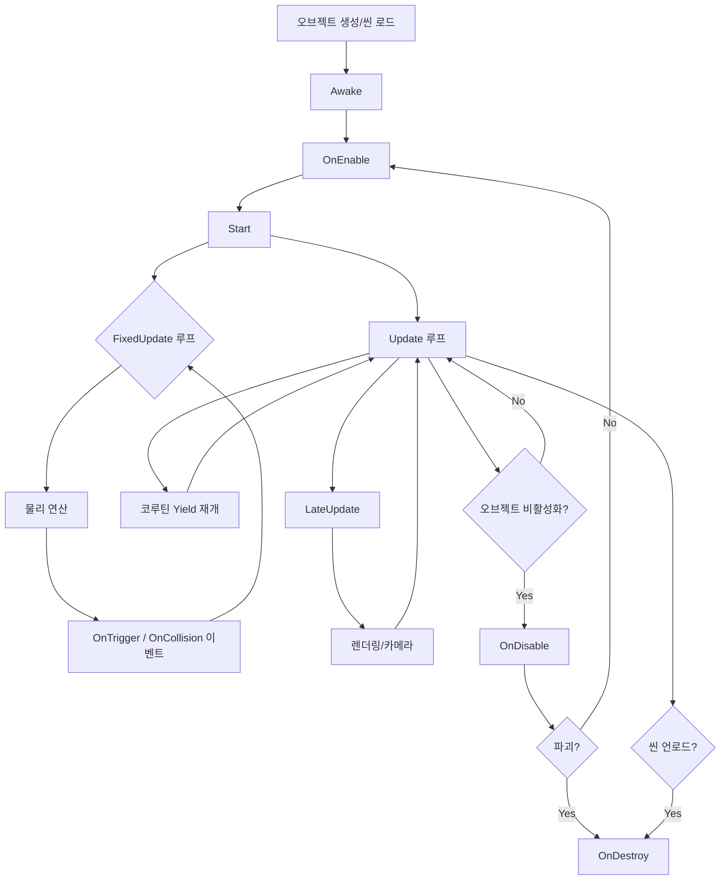

# [UnityEngine] Unity Lifecycle

- **Date**: 2026-06-14
- **Tags**: #Unity #Lifecycle #MonoBehaviour #EventFunction

---

# 1. 개요

---

Unity 스크립트의 핵심인 `MonoBehaviour`는 엔진이 자동으로 호출하는 **생명주기 이벤트 함수(Event Function)**들로 구성됩니다. 실행 순서를 정확히 이해해야 타이밍 버그, NullReference, 초기화 순서 문제를 예방할 수 있습니다.

```
[게임 실행]
    |
    v
Editor 초기화 → Awake() → OnEnable() → Start()
    |
    v
    +---- FixedUpdate() (물리, 고정 간격) ----+
    |                                          |
    v                                          v
 Update() (매 프레임) ←--- 입력/로직 처리
    |
    v
 LateUpdate() (카메라, 후처리)
    |
    v
[씬 언로드 / 종료]
    |
    v
OnDisable() → OnDestroy()
```

---

# 2. 실행 순서 상세

---

### 1) 전체 흐름 (공식 문서 기준)

| 단계 | 함수 | 설명 | 타이밍 |
|------|------|------|--------|
| 초기화 | `Awake()` | 오브젝트 생성 직후 1회 | 모든 스크립트의 Awake 종료 후 Start 실행 |
| 활성화 | `OnEnable()` | 오브젝트/컴포넌트가 활성화될 때 | Awake 직후, 활성화될 때마다 호출 |
| 초기화 완료 | `Start()` | 첫 Update 직전 1회 | 모든 Awake가 끝난 후 |
| 물리 | `FixedUpdate()` | 물리 연산용 고정 간격 업데이트 | 기본 0.02초(50Hz) 간격 |
| 프레임 | `Update()` | 매 프레임 로직 처리 | 프레임마다 1회 |
| 후처리 | `LateUpdate()` | 모든 Update 종료 후 | Update → 카메라 움직임 직전 |
| 비활성화 | `OnDisable()` | 오브젝트/컴포넌트가 비활성화될 때 | 파괴 직전 또는 비활성화 시 |
| 파괴 | `OnDestroy()` | 오브젝트 제거 직전 1회 | 씬 언로드 또는 Destroy() 호출 시 |
| 종료 | `OnApplicationQuit()` | 앱 종료 직전 1회 | 에디터 Play 중지, 빌드 종료 |

---

### 2) 상세 흐름도



---

# 3. 각 함수 심층 분석

---

### 1) `Awake()` — 초기화의 시작

- 오브젝트가 생성된 직후, **활성 상태와 무관하게** 항상 호출됩니다.
- 자신의 컴포넌트 참조를 캐싱하고, 다른 스크립트의 Awake가 완료되길 기다리지 않습니다.
- **권장 용도**: `GetComponent<>()` 캐싱, 정적 변수 초기화, null-safe한 내부 상태 설정.

```csharp
private Rigidbody _rb;
private Animator _anim;

void Awake()
{
    _rb = GetComponent<Rigidbody>();
    _anim = GetComponent<Animator>();
}
```

> **주의**: 다른 오브젝트의 `Awake` 실행 순서는 **보장되지 않습니다**. 오브젝트 간 참조가 필요하면 `Start()`에서 처리하세요.

---

### 2) `OnEnable()` — 활성화 트리거

- 컴포넌트가 **enabled = true**가 될 때마다 호출됩니다.
- `Awake()` 직후, 그리고 비활성화 후 다시 활성화될 때도 호출됩니다.
- **권장 용도**: 이벤트 구독/해지, 활성화 상태와 연동된 로직.

```csharp
void OnEnable()
{
    GameManager.OnScoreChanged += UpdateUI;
}

void OnDisable()
{
    GameManager.OnScoreChanged -= UpdateUI;
}
```

> **팁**: `OnEnable`/`OnDisable` 쌍으로 이벤트를 구독/해지하면 오브젝트 풀에서 재사용될 때 안전합니다.

---

### 3) `Start()` — 첫 프레임 전 초기화

- 모든 `Awake()`가 끝난 후, 첫 `Update()` 직전에 **단 한 번** 호출됩니다.
- 다른 오브젝트가 Awake 단계에서 준비를 마친 상태이므로 **오브젝트 간 참조**를 안전하게 할 수 있습니다.
- **권장 용도**: 외부 오브젝트/매니저 참조, 초기값 할당.

```csharp
void Start()
{
    // 다른 매니저의 Awake가 이미 실행된 상태
    GameManager.Instance.RegisterPlayer(this);
    _hp = _maxHp;
}
```

---

### 4) `FixedUpdate()` — 물리 동기화

- **고정 시간 간격**(default 0.02초, 50Hz)으로 호출됩니다.
- 물리 엔진과 동기화되어 실행되며, `Update()`보다 **먼저** 호출됩니다.
- `Time.deltaTime` 대신 `Time.fixedDeltaTime`을 사용합니다.
- **권장 용도**: Rigidbody 힘/속도 변경, 물리 판정, 쿼리(Physics.Raycast 등).

```csharp
void FixedUpdate()
{
    Vector3 move = new Vector3(_inputX, 0, _inputY);
    _rb.AddForce(move * _speed * Time.fixedDeltaTime, ForceMode.Acceleration);
}
```

> **주의**: `FixedUpdate` 간격이 길면 물리가 끊겨 보일 수 있습니다. `Time.fixedDeltaTime`을 줄이거나 `Time.timeScale` 조정으로 보완합니다.

---

### 5) `Update()` — 프레임 로직

- 매 프레임마다 1회 호출됩니다. 프레임률에 따라 호출 간격이 달라집니다.
- 입력 처리, 비물리 이동, 타이머, 상태 머신 등 **대부분의 게임 로직**을 담당합니다.
- 프레임 의존성을 없애려면 `Time.deltaTime`을 곱합니다.

```csharp
void Update()
{
    if (Input.GetKeyDown(KeyCode.Space))
    {
        Jump();
    }
    transform.position += _direction * _speed * Time.deltaTime;
}
```

---

### 6) `LateUpdate()` — 카메라/후처리

- 모든 `Update()`가 종료된 후 호출됩니다.
- 다른 오브젝트의 Update가 완료된 상태이므로 **카메라 추적**, **Gizmo 업데이트**, **UI 동기화**에 적합합니다.

```csharp
void LateUpdate()
{
    // 플레이어 이동이 끝난 후 카메라가 따라감 → 프레임 지터 방지
    _camTransform.position = _target.position + _offset;
}
```

---

### 7) `OnDisable()` / `OnDestroy()` — 정리

| 함수 | 호출 조건 |
|------|-----------|
| `OnDisable()` | `enabled = false`, 오브젝트 비활성화, `Destroy()` 직전 |
| `OnDestroy()` | `Destroy()` 호출, 씬 언로드, 에디터 Play 중지 |

```csharp
void OnDestroy()
{
    // 풀에서 반환 시 등록 해제
    ItemPool.Instance.Return(this);
}
```

---

# 4. 고급 주제

---

### 1) 실행 순서 커스터마이징

`Edit > Project Settings > Script Execution Order`에서 스크립트 실행 순서를 강제할 수 있습니다.

| 설정 | 효과 |
|------|------|
| **Default Time** | 카테고리 미지정 스크립트 |
| **+ / - 버튼** | 특정 스크립트를 먼저/나중에 실행 |
| **Negative Number** | 기본보다 먼저 실행 (ex: -50) |
| **Positive Number** | 기본보다 나중에 실행 (ex: +50) |

> **팁**: 매니저 계열은 -50 ~ -100으로 설정, 플레이어/적 스크립트는 0 유지가 일반적입니다.

---

### 2) 코루틴과 생명주기

- `StartCoroutine()`은 `Update()`와 같은 프레임 루프 위에서 동작합니다.
- `yield return null` → 다음 `Update()` 직후 재개
- `yield return new WaitForFixedUpdate()` → 다음 `FixedUpdate()` 직후 재개
- `yield return new WaitForEndOfFrame()` → 렌더링 완료 직후 재개

```csharp
IEnumerator AttackRoutine()
{
    _anim.SetTrigger("Attack");
    yield return new WaitForSeconds(_attackDuration); // Update 기반 대기
    DealDamage();
}
```

---

### 3) 오브젝트 상태와 생명주기

```
활성화된 오브젝트 (activeInHierarchy = true)
  ├── enabled = true  → Awake → OnEnable → Start → Update 루프
  ├── enabled = false → OnDisable 호출, Update 중단 (Awake/Start 유지)
  └── SetActive(false) → OnDisable(하위 포함) → Update 중단

비활성화된 오브젝트 (activeInHierarchy = false)
  └── Awake/Start/Update 모두 미호출
```

| `SetActive(false)` 후 `SetActive(true)` |
|------------------------------------------|
| `OnDisable()` 호출 → (`OnEnable()` + `Start()`는? **Start는 재호출 안 됨**) |
| → `Awake()`는 1회, `Start()`는 1회, `OnEnable()`은 활성화될 때마다 호출 |

---

### 4) 파괴 타이밍 주의

```csharp
void OnTriggerEnter(Collider other)
{
    Destroy(other.gameObject);
    // 이 시점에서 other의 OnDisable → OnDestroy가 호출되지만,
    // 현재 함수가 끝날 때까지 other의 메모리는 완전히 해제되지 않음
    // other.transform == null? → true
    // other.gameObject == null? → true (but beware of pseudo-null)
}
```

> Unity의 `Destroy()`는 즉시 제거되지 않고 **현재 프레임 종료 시점**에 제거됩니다. `DestroyImmediate()`는 즉시 제거하지만 권장되지 않습니다.

---

### 5) NullReference 방지 패턴

```csharp
private static MyManager _instance;
public static MyManager Instance
{
    get
    {
        if (_instance == null)
            _instance = FindObjectOfType<MyManager>();
        return _instance;
    }
}
```

`FindObjectOfType`는 느리므로 `Awake`에서 캐싱하는 편이 좋습니다.

---

# 5. 실무 팁 모음

---

### 1) 초기화 순서 베스트 프랙티스

```
Awake()   → 내부 컴포넌트 캐싱 (GetComponent)
Start()   → 외부 오브젝트 참조 (Find, Singleton 접근)
Update()  → 매 프레임 로직
```

### 2) 프로파일링 시 확인할 것

- `Update()`가 무거우면 `FixedUpdate()` 지연 → 물리 끊김
- `LateUpdate()`가 무거우면 카메라 컷/지연
- `OnEnable`/`OnDisable`에 GC 할당이 있는지 확인 (특히 이벤트 구독/해지)

### 3) 주요 주의사항

- `gameObject.SetActive(false)`는 **OnDisable만** 호출, OnDestroy는 호출 안 함
- `Destroy(obj, 2f)`처럼 지연 파괴 시에도 생명주기 함수는 정상 호출됨
- `Application.quitting` 시 `DontDestroyOnLoad` 오브젝트들의 파괴 순서는 부분적으로만 보장됨

---

# Related

- [[Design Pattern] 싱글톤 패턴](./%5BDesign%20Pattern%5D%20%EC%8B%B1%EA%B8%80%ED%86%A4%20%ED%8C%A8%ED%84%B4.md)
- [[Debug] NullReference](<../Debug_log/[Debug] NullReference.md>)

---

**출처**: Unity Manual — Order of Execution for Event Functions · Unity Learn — Beginner Scripting

