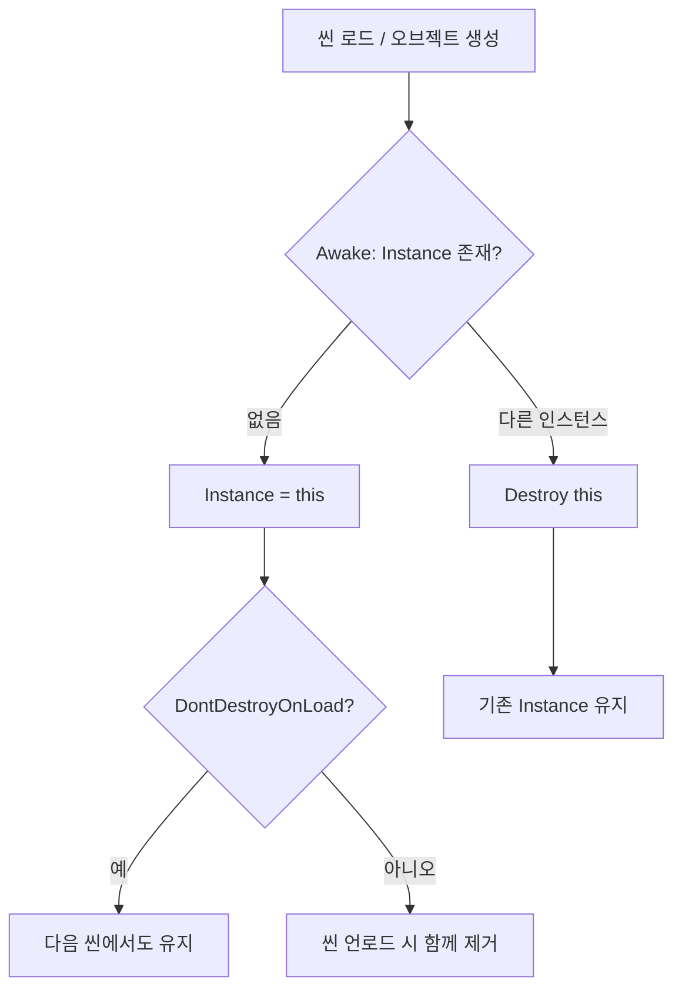

# Singleton Pattern

- **Date**: 2026-06-04
- **Tags**: #Unity #DesignPattern #Architecture

## 1. 개요 (Overview)

**싱글톤(Singleton)**은 클래스의 인스턴스가 **전역에서 단 하나만** 존재하도록 보장하는 생성 패턴입니다. Unity에서는 `GameManager`, `AudioManager`, `UIManager`처럼 씬·오브젝트 전반에서 공유되는 매니저를 접근하기 쉽게 만들 때 자주 씁니다.

```csharp
// 어디서든 동일한 인스턴스에 접근
GameManager.Instance.StartGame();
```

## 2. 왜 사용하는가? (Benefits & Trade-offs)

### 장점
- **전역 접근**: `Instance` 한 줄로 매니저에 도달 가능
- **상태 일관성**: 점수, 사운드 볼륨, 플레이어 데이터 등이 한 곳에 모임
- **구현이 단순**: 소규모 프로토타입·학습 프로젝트에서 빠르게 붙일 수 있음

### 단점 (주의)
- **강한 결합**: `SomeClass`가 `GameManager.Instance`에 직접 의존 → 테스트·교체가 어려움
- **숨은 의존성**: 생성자/필드에 드러나지 않아 구조 파악이 어려움
- **생명주기 복잡**: 씬 전환, `DontDestroyOnLoad`, 중복 오브젝트 처리를 직접 관리해야 함

> 프로젝트가 커지면 **ScriptableObject 이벤트 채널**, **DI(의존성 주입)**, **서비스 로케이터** 등으로 점진적으로 대체하는 경우가 많습니다.

## 3. Unity에서의 핵심 이슈

| 이슈 | 설명 |
|------|------|
| **MonoBehaviour vs 순수 C#** | `MonoBehaviour`는 씬에 오브젝트가 있어야 하므로 `Awake`/`Start`에서 인스턴스를 등록하는 패턴이 일반적 |
| **중복 인스턴스** | 같은 매니저 프리팹이 씬에 두 개 있으면 충돌 → `Awake`에서 기존 인스턴스가 있으면 `Destroy` |
| **씬 전환** | `DontDestroyOnLoad`로 유지할지, 씬마다 새로 만들지 설계를 먼저 정함 |
| **실행 순서** | `Awake`/`Start` 순서에 따라 `Instance`가 `null`일 수 있음 → 초기화 타이밍 주의 |
| **에디터/플레이 모드** | static 필드는 도메인 리로드 설정에 따라 에디터에서 남을 수 있음 |

## 4. 구현 패턴

### 4-1. 순수 C# 싱글톤 (MonoBehaviour 아님)

데이터·로직만 전역으로 두고, Unity 생명주기와 무관할 때 사용합니다.

```csharp
public sealed class SaveDataManager
{
    private static SaveDataManager _instance;
    public static SaveDataManager Instance => _instance ??= new SaveDataManager();

    private SaveDataManager() { } // 외부에서 new 방지

    public void Save() { /* ... */ }
}
```

### 4-2. MonoBehaviour 싱글톤 (가장 흔한 형태)

씬에 빈 GameObject + 스크립트를 두거나, 프리팹으로 배치합니다.

```csharp
using UnityEngine;

public class GameManager : MonoBehaviour
{
    public static GameManager Instance { get; private set; }

    void Awake()
    {
        if (Instance != null && Instance != this)
        {
            Destroy(gameObject);
            return;
        }

        Instance = this;
        DontDestroyOnLoad(gameObject); // 씬 전환 후에도 유지할 때만
    }

    void OnDestroy()
    {
        if (Instance == this)
            Instance = null;
    }
}
```

### 4-3. 제네릭 베이스 클래스 (재사용)

여러 매니저에 동일한 보일러플레이트를 줄일 때 유용합니다.

```csharp
using UnityEngine;

public abstract class Singleton<T> : MonoBehaviour where T : MonoBehaviour
{
    public static T Instance { get; private set; }

    protected virtual void Awake()
    {
        if (Instance != null && Instance != this)
        {
            Destroy(gameObject);
            return;
        }
        Instance = this as T;
    }

    protected virtual void OnDestroy()
    {
        if (Instance == this)
            Instance = null;
    }
}

// 사용
public class AudioManager : Singleton<AudioManager>
{
    public void PlaySFX(string clipName) { /* ... */ }
}
```

`DontDestroyOnLoad`가 필요한 매니저만 하위 클래스에서 `Awake`를 override해 추가합니다.

### 4-4. Lazy 초기화 (씬에 없을 때 찾기)

씬에 미리 배치하지 않고, 첫 접근 시 찾거나 생성하는 방식입니다. 편하지만 **숨은 생성 비용**과 **Find 비용**이 있습니다.

```csharp
// Unity 2023.1+ : FindObjectOfType 대신 FindFirstObjectByType 권장
var manager = FindFirstObjectByType<GameManager>();
if (manager == null)
{
    var go = new GameObject(nameof(GameManager));
    manager = go.AddComponent<GameManager>();
}
```

> 프로덕션에서는 **씬/부트스트랩 씬에 명시적으로 배치**하는 편이 디버깅과 실행 순서 측면에서 안전합니다.

## 5. 생명주기 흐름 (요약)



## 6. 실무 팁

1. **`Instance` null 체크**: `Start`보다 먼저 다른 스크립트가 접근할 수 있으므로, 필수 매니저는 부트스트랩 씬에서 가장 먼저 초기화되게 배치합니다.
2. **중복 방지는 `Awake`에서**: `Start`보다 일찍 실행되어 다른 스크립트의 `Awake`에서 `Instance`를 쓸 수 있습니다.
3. **`OnDestroy`에서 static 정리**: 씬 전환·재시작 시 stale reference 방지.
4. **테스트 가능성**: 가능하면 `public static Instance` 대신 **인터페이스 + 주입**을 고려하고, 싱글톤은 진입점(부트스트랩)에만 둡니다.
5. **에디터 전용**: `[RuntimeInitializeOnLoadMethod]`로 static 초기화가 필요한 경우만 사용 — 남용하지 않기.

## 7. 언제 쓰고, 언제 피할까

| 상황 | 권장 |
|------|------|
| 프로토타입, Game Jam, 단일 매니저 1~2개 | 싱글톤 OK |
| 여러 시스템이 서로 `Instance`를 참조 | 결합도 급증 → 이벤트/SO/DI 검토 |
| 유닛 테스트·모킹 필요 | 싱글톤 지양 |
| 네트워크 멀티플레이 | 전역 단일 상태가 버그 원인 → 명시적 서비스 계층 |

## 8. 관련 패턴

- **Object Pooling**: 풀 매니저를 싱글톤으로 두는 경우가 많음 → [object_pooling_pattern.md](./object_pooling_pattern.md)
- **Service Locator**: 싱글톤의 전역 접근성은 유지하되, 등록·조회를 한곳에 모음
- **ScriptableObject Architecture**: 전역 상태 대신 에셋 기반 이벤트/변수 공유

---
**출처**: Gang of Four — Design Patterns (Singleton) · Unity Manual (MonoBehaviour lifecycle, DontDestroyOnLoad) · 일반적인 Unity 커뮤니티 관행
